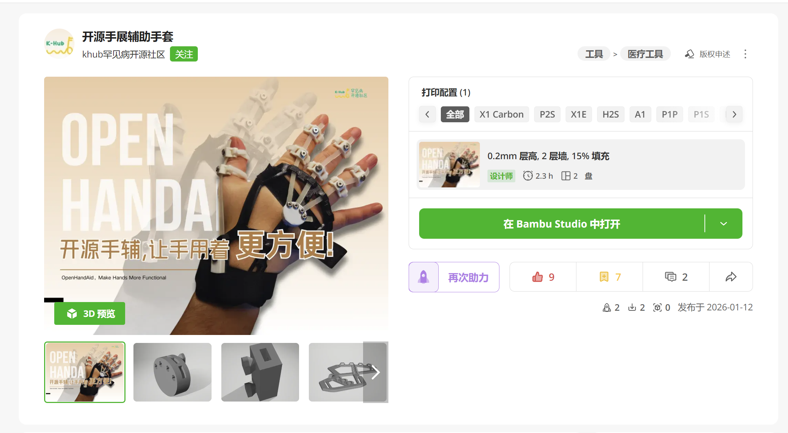
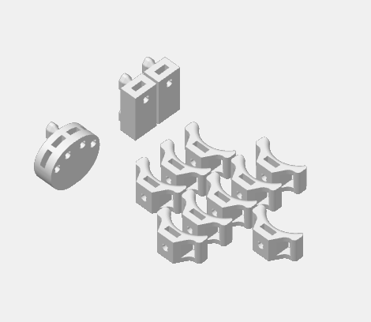
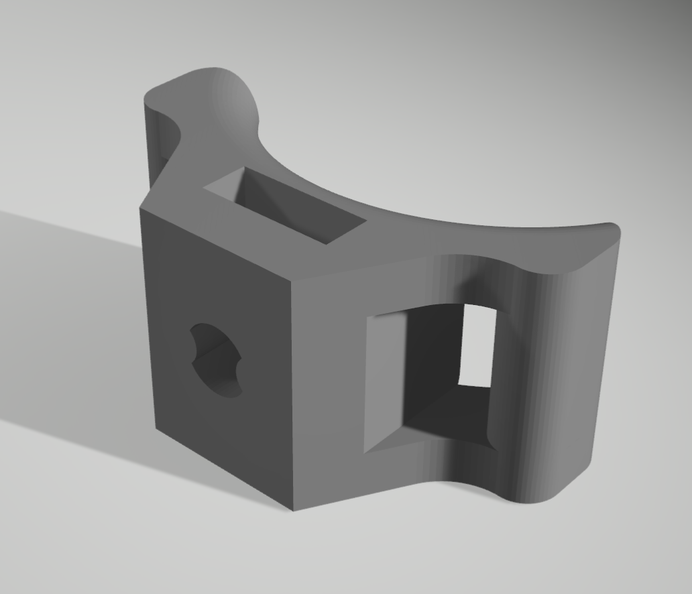
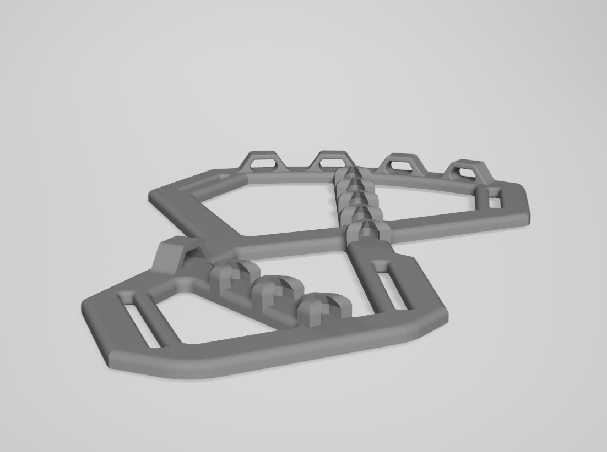
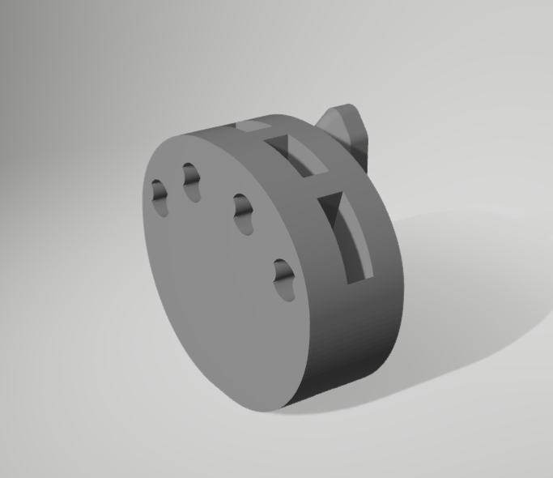
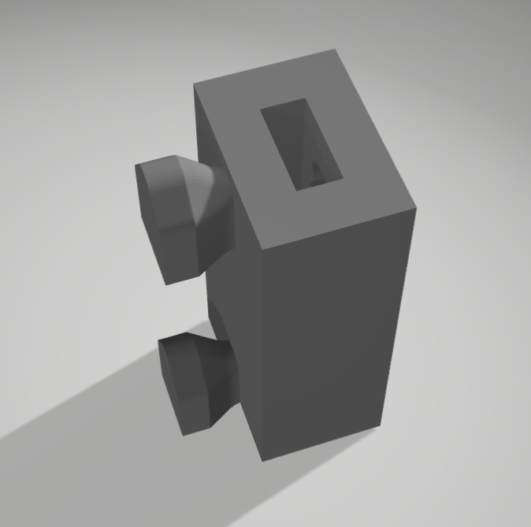

# OpenHandAid | 开源手展辅助手套

> 让受限的手，多一点可控感。

OpenHandAid 是一个开源 3D 打印手部辅具项目。它从病友真实生活中的困难出发，尝试用 3D 打印结构、魔术贴固定和弹力辅助，帮助手指从蜷缩状态中打开，并支持一些轻量日常动作，比如拿杯、拿碗、拿筷子、打字。

这个项目还在迭代中。它不是医疗器械，也不替代医生、康复师或专业治疗建议。我们把它开源出来，是希望让更多病友、家属、3D 打印志愿者、开发者和公益伙伴一起参与改进。

## 🌱 这个项目为什么存在

对很多肌肉萎缩或神经肌肉相关疾病的病友来说，手部功能受限不只是“力气小一点”。

一些很日常的动作，比如吃饭、夹菜、拿杯子、操作手机、回一条微信，都可能需要反复尝试，甚至需要家人帮忙。

现有辅具常常会遇到几个问题：

- 价格高，普通家庭不一定容易尝试。
- 购买和适配渠道复杂。
- 尺寸、手型、病情差异很大，很难一个产品适配所有人。
- 很多工具不适合真实居家场景长期使用。

所以我们从一个更朴素的方向开始：能不能用开源、低成本、可打印、可修改的方式，先做出一个可以被继续改进的手部辅具原型？

## ✋ 它现在能做什么

当前版本 `OpenHandAid-v1` 主要尝试辅助这些动作：

- 帮助手指从自然蜷缩状态中打开。
- 辅助手掌撑开。
- 辅助完成部分轻量抓握或夹取动作。
- 在部分场景中辅助拿杯、拿碗、拿筷子、打字。

它不是“戴上就恢复手部功能”的产品。更准确地说，它是一个正在被真实反馈推动的开源辅具原型。

## 👀 谁可以关注这个项目

### 病友 / 家属

如果你或家人有手指张开困难、抓握不稳定、日常夹取动作受限等情况，可以关注这个项目，也欢迎反馈真实使用场景。

### 3D 打印志愿者

如果你有 3D 打印设备，可以尝试复现当前版本，帮助验证打印参数、材料选择和组装流程。

### 开发者 / 研究者

如果你关注结构设计、材料、人机工程、康复工程、肌电、外骨骼或开源文档，可以选择一个小方向参与优化。

### 公益组织 / 企业

如果你希望支持材料、打印、物流、测试组织或病友家庭定向制作，也欢迎参与。

## 🔗 快速入口

- 模型主下载入口：[MakerWorld 模型页](https://makerworld.com.cn/zh/models/2005480-kai-yuan-shou-zhan-fu-zhu-shou-tao?appSharePlatform=wx#profileId-2234460)
- 当前公开版本：`OpenHandAid-v1`
- 发起方：Khub 罕见病开源社区
- 第一代火种开发者：斯坦星球 ideaLab: 大卫老师团队

如果你只是想下载并打印当前公开版本，建议优先从 MakerWorld 获取。GitHub 仓库主要用于保存说明文档、BOM、反馈模板和后续共建记录。

## 🎬 演示视频

当前已有拿筷子动作演示视频，可以直接查看：

- [拿筷子动作演示 MP4](media/demo-chopsticks.mp4)
- 佩戴流程：待补
- 组装流程：待补
- 拿杯 / 打字测试：待补

## 🧩 当前文件里有什么

### 模型文件

| 文件 | 说明 | 建议材料 |
| --- | --- | --- |
| `models/stl/finger.stl` | 指部零件 | PETG |
| `models/stl/hand-heated-part.stl` | 手背/掌部柔性固定结构 | TPU95A |
| `models/stl/strap-holder-v2.stl` | 魔术贴 / 绑带固定件 | PETG |
| `models/stl/strap-holder-thumb-v2.stl` | 拇指侧魔术贴 / 绑带固定件 | PETG |
| `models/bambu-studio/openhandaid-public-v1.3mf` | Bambu Studio 项目文件 | 按切片配置 |

零件预览图放在 `docs/images/`，用于说明和组装文档。

| 指部零件 | 手背/掌部柔性固定结构 |
| --- | --- |
|  |  |

| 魔术贴/绑带固定件 | 拇指侧固定件 |
| --- | --- |
|  |  |

### 文档

- [BOM 物料清单](docs/bom.md)
- [打印参数](docs/print-settings.md)
- [组装说明草稿](docs/assembly-guide.md)
- [使用与安全边界](docs/usage-and-safety.md)
- [反馈模板](docs/feedback-template.md)

## 🖨️ 打印建议

当前 MakerWorld 页面配置：

- 层高：0.2 mm
- 墙数：2
- 填充：15%
- 估算打印时间：约 2.3 小时

材料方向：

- PETG：用于需要支撑和强度的关节、骨架、固定件。
- TPU95A：用于 `hand-heated-part.stl` 对应的手背 / 掌部柔性固定结构。

更详细内容见：[docs/print-settings.md](docs/print-settings.md)

## 🧾 物料清单

当前 BOM 来自项目原始 Excel，已经整理成 Markdown：

- 固定螺丝：倒边内六角螺丝 M3x5
- 魔术贴（手掌位置）：勾毛同体魔术贴 2cm
- 魔术贴（手指位置）：勾毛同体魔术贴 0.5cm
- 扳手：球头 2mm
- 橡胶圈：对折 7.5cm，宽 5mm

详见：[docs/bom.md](docs/bom.md)

## 🛠️ 我们希望一起改进什么

当前版本已经能证明方向有价值，但还有很多地方需要继续优化：

- 佩戴更简单：让病友更容易独立佩戴。
- 更舒适：减少压痛、勒痕、滑动和硬质边缘不适。
- 更好适配：建立手掌宽度、手指长度、手背结构的测量规则。
- 更容易复现：完善打印参数、BOM、组装说明和常见问题。
- 更多动作测试：拿杯、打字、拿碗、不同手型和不同病友反馈。

## 💬 如何反馈

如果你是病友、家属、志愿者或开发者，欢迎记录这些信息：

- 你希望改善的具体动作是什么？
- 当前手部最困难的动作是什么？
- 佩戴是否顺利？
- 哪些地方有压痛、勒痕、滑动或不适？
- 哪些动作有改善？
- 你希望下一版优先改什么？

可以参考：[docs/feedback-template.md](docs/feedback-template.md)

## 🤝 如何参与

你可以从很小的事情开始：

- 复现一次打印，并记录参数。
- 拍一张组装过程图。
- 帮忙改进 BOM 或组装文档。
- 提交一个真实使用问题。
- 帮忙匿名整理病友反馈。
- 做一个更舒适、更容易佩戴的小改动。

开源项目不需要所有人都做大事。一个清楚的问题、一张有用的照片、一次失败的打印记录，也可能帮助下一位使用者少走弯路。

## 📜 许可证

本项目沿用 MakerWorld 模型页的 Creative Commons Attribution-NonCommercial 许可，即 `CC BY-NC`。

你可以在署名且非商业用途下分享和改编本项目。请勿将本项目用于商业用途。

详见：[LICENSE.md](LICENSE.md)

## 🙏 致谢

- Khub 罕见病开源社区：项目发起与病友需求连接。
- 斯坦星球 ideaLab: 大卫老师团队：第一代火种开发者。
